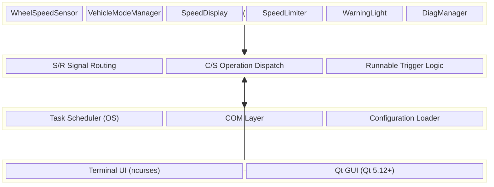
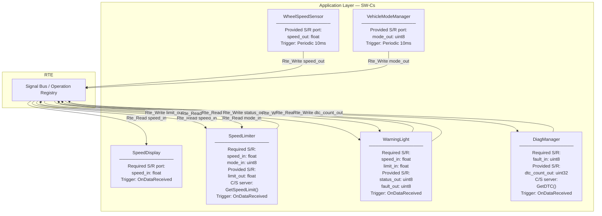
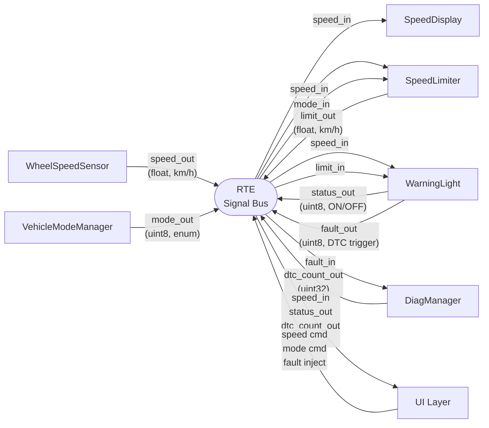
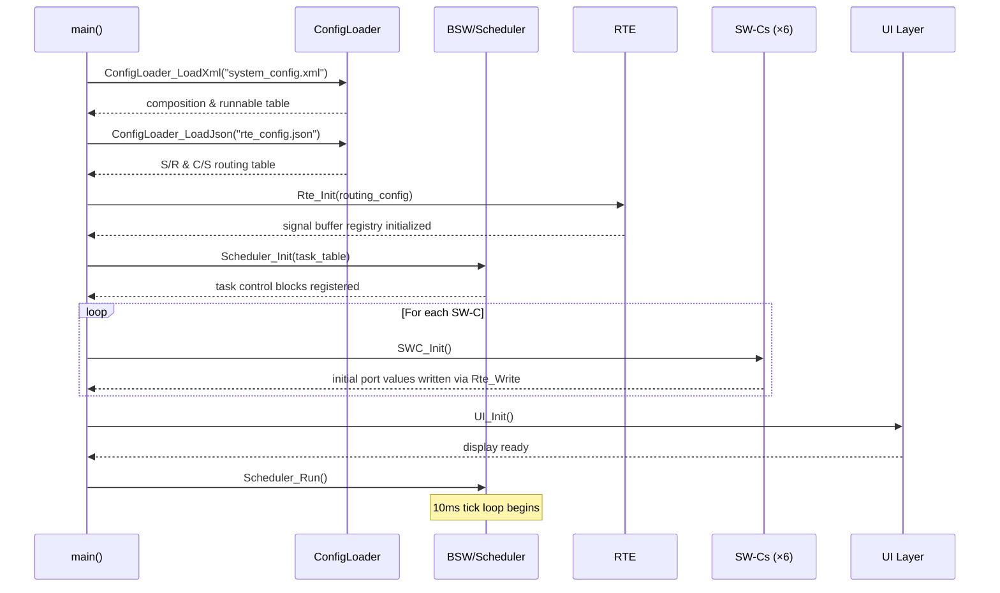
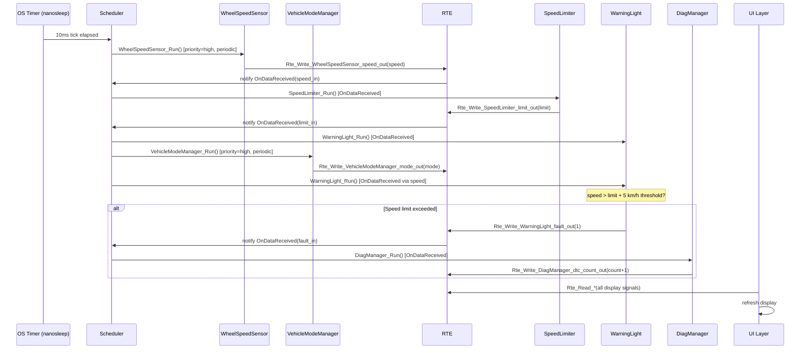
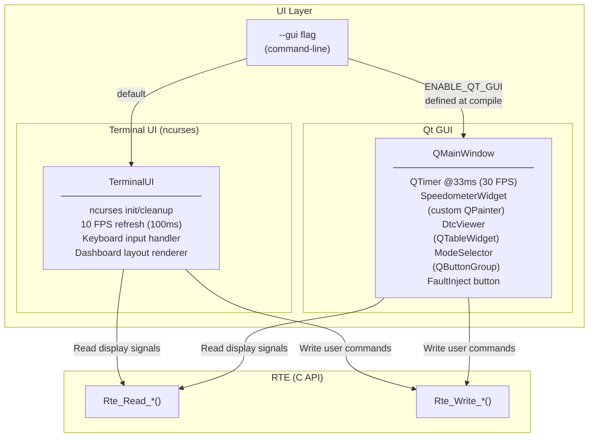
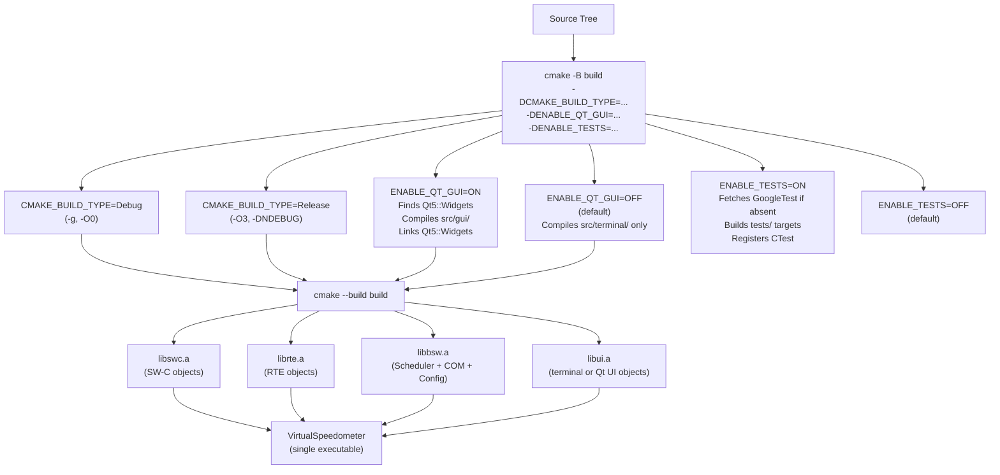

# System Architecture Document
# Virtual Speedometer — AUTOSAR Application Layer Simulation

**Document Version:** 1.0
**Date:** 2026-02-18
**Status:** Approved
**Authors:** Development Team
**Classification:** Educational/Portfolio Project

---

## Revision History

| Version | Date | Author | Description |
|---------|------|--------|-------------|
| 1.0 | 2026-02-18 | Development Team | Initial release |

---

## Table of Contents

1. [Overview](#1-overview)
2. [System Architecture](#2-system-architecture)
3. [Layer Descriptions](#3-layer-descriptions)
4. [Component Architecture](#4-component-architecture)
5. [Communication Architecture](#5-communication-architecture)
6. [Data Flow Architecture](#6-data-flow-architecture)
7. [RTE Internal Architecture](#7-rte-internal-architecture)
8. [BSW Architecture](#8-bsw-architecture)
9. [UI Architecture](#9-ui-architecture)
10. [Directory Structure](#10-directory-structure)
11. [Deployment / Build Architecture](#11-deployment--build-architecture)
12. [Performance Architecture](#12-performance-architecture)
13. [Testing Architecture](#13-testing-architecture)
14. [Key Design Decisions](#14-key-design-decisions)
15. [Requirements Traceability](#15-requirements-traceability)

---

## 1. Overview

### 1.1 Purpose

This System Architecture Document (SAD) defines the software architecture for the Virtual Speedometer, an educational simulation of an AUTOSAR (AUTomotive Open System ARchitecture) Classic Platform application layer. It establishes the structural decomposition, communication patterns, performance budgets, and design rationale that guide implementation.

This document is the primary reference for:
- Developers implementing or extending the system
- QA engineers designing test strategies
- Reviewers evaluating architectural decisions
- Learners studying AUTOSAR patterns

### 1.2 Scope

The architecture covers all four layers of the system (Application SW-Cs, RTE, BSW, and UI), the inter-layer communication contracts, build and deployment topology, and test strategy. Real hardware integration, production certification, and non-Linux platform support are explicitly out of scope (see SRS §1.2).

### 1.3 Applicable SRS Requirements

This document addresses the following SRS requirement groups:

| Group | IDs | Count |
|-------|-----|-------|
| Architecture | SRS-ARCH-001 – SRS-ARCH-015 | 15 |
| Interface | SRS-IF-001 – SRS-IF-035 | 24 |
| Performance | SRS-PERF-001 – SRS-PERF-012 | 12 |
| Build | SRS-BUILD-001 – SRS-BUILD-015 | 15 |
| Configuration | SRS-CFG-001 – SRS-CFG-014 | 14 |
| Testing | SRS-TEST-001 – SRS-TEST-014 | 14 |

Full traceability is provided in [Section 15](#15-requirements-traceability).

---

## 2. System Architecture

The system is organized into four horizontal layers following the AUTOSAR Classic Platform model. Each layer has a strictly defined contract: layers may only call downward (Application → RTE → BSW; UI → RTE) and never upward.



**SRS mapping:** SRS-ARCH-001 (four-layer model), SRS-ARCH-002/003 (SW-C isolation via RTE), SRS-ARCH-010/011 (UI read-only access).

---

## 3. Layer Descriptions

### 3.1 Application Layer (SW-Cs)

| Attribute | Value |
|-----------|-------|
| Language | C++17 |
| Standard | AUTOSAR SWS SW-Component Template (simplified) |
| Files | `src/swc/*.cpp`, `src/swc/*.h` |

**Responsibilities:**
- Implement vehicle domain logic (speed sensing, mode management, limit enforcement, warnings, diagnostics, display formatting)
- Declare provided and required ports matching the RTE signal registry
- Execute runnables when triggered by the Scheduler (periodic) or RTE (on-data-reception)

**Key constraints:**
- No direct function calls between SW-Cs (SRS-ARCH-002/003)
- All inter-SW-C data exchange via `Rte_Write` / `Rte_Read` / `Rte_Call` APIs
- C++ dynamic allocation is permitted within SW-Cs; forbidden in RTE/BSW

### 3.2 Runtime Environment (RTE)

| Attribute | Value |
|-----------|-------|
| Language | C11 |
| Standard | MISRA-C:2012 (where practical, SRS-ARCH-008) |
| Files | `src/bsw/rte/rte.c`, `rte.h`, `rte_internal.h` |

**Responsibilities:**
- Maintain static signal buffer registry (S/R connections)
- Maintain static C/S operation registry
- Route `Rte_Write` calls to all connected required-port buffers
- Dispatch `Rte_Call` to registered server operation
- Notify Scheduler when on-data-reception runnables must execute

**Key constraints:**
- No dynamic memory allocation (SRS-ARCH-013/015)
- All buffers statically sized (`MAX_SR_CONNECTIONS=50`, `MAX_CS_CONNECTIONS=20`)
- All public APIs declared `extern "C"` for C++ SW-C linkage (SRS-IF-035)

### 3.3 Basic Software (BSW)

| Attribute | Value |
|-----------|-------|
| Language | C11 |
| Standard | MISRA-C:2012 (where practical, SRS-ARCH-007) |
| Files | `src/bsw/os/scheduler.c`, `src/bsw/com/com.c`, `src/bsw/config_loader.c` |

**Responsibilities:**
- Execute tasks in deterministic 10ms tick loop
- Pack/unpack CAN frame signals for COM simulation
- Load and validate XML/JSON configuration files at startup

**Key constraints:**
- No dynamic memory allocation (SRS-ARCH-014)
- Task table statically allocated (`MAX_TASKS=20`)
- Priority-based scheduling; round-robin within equal priority (SRS-PERF-009/010)

### 3.4 UI Layer

| Attribute | Value |
|-----------|-------|
| Language | C++17 |
| Libraries | ncurses (terminal), Qt 5.12+ (GUI) |
| Files | `src/terminal/terminal_ui.cpp`, `src/gui/*.cpp` |

**Responsibilities:**
- Read RTE signal buffers via `Rte_Read` for display
- Write user input to RTE signal buffers via `Rte_Write` for SW-C consumption
- Render dashboard at ≥10 FPS (terminal) or ≥30 FPS (Qt)

**Key constraints:**
- Read-only access to SW-C output data; never invokes SW-C runnables directly (SRS-ARCH-010/011)
- Compile-time selection via `ENABLE_QT_GUI` CMake flag (SRS-ARCH-012)

---

## 4. Component Architecture

The six SW-Cs and their port types are shown below. Solid arrows represent S/R ports; dashed arrows represent C/S ports.



### 4.1 Port Summary Table

| SW-C | Port Name | Direction | Type | Data Type | Trigger |
|------|-----------|-----------|------|-----------|---------|
| WheelSpeedSensor | speed_out | Provided | S/R | float | Periodic 10ms |
| VehicleModeManager | mode_out | Provided | S/R | uint8 | Periodic 10ms |
| SpeedDisplay | speed_in | Required | S/R | float | OnDataReceived |
| SpeedLimiter | speed_in | Required | S/R | float | OnDataReceived |
| SpeedLimiter | mode_in | Required | S/R | uint8 | OnDataReceived |
| SpeedLimiter | limit_out | Provided | S/R | float | — |
| SpeedLimiter | GetSpeedLimit | Provided | C/S | — | On call |
| WarningLight | speed_in | Required | S/R | float | OnDataReceived |
| WarningLight | limit_in | Required | S/R | float | OnDataReceived |
| WarningLight | status_out | Provided | S/R | uint8 | — |
| WarningLight | fault_out | Provided | S/R | uint8 | — |
| DiagManager | fault_in | Required | S/R | uint8 | OnDataReceived |
| DiagManager | dtc_count_out | Provided | S/R | uint32 | — |
| DiagManager | GetDTC | Provided | C/S | — | On call |

---

## 5. Communication Architecture

### 5.1 Signal Routing Map

The complete inter-component signal flow:



**Fan-out:** `speed_out` is routed to three receivers (SpeedDisplay, SpeedLimiter, WarningLight) — this is a 1-to-N S/R connection satisfying SRS-IF-009 and SRS-CFG-014.

### 5.2 Sender-Receiver Pattern

The S/R pattern provides asynchronous, data-oriented communication:

| Aspect | Detail |
|--------|--------|
| Write API | `Rte_Write_<SWC>_<port>(value)` → `Std_ReturnType` |
| Read API | `Rte_Read_<SWC>_<port>(value*)` → `Std_ReturnType` |
| Semantics | Latest-value; each write overwrites the buffer |
| Fan-out | RTE iterates all registered receivers for a given signal |
| Memory | Static buffer per connection; no heap allocation |
| Trigger | `Rte_Write` notifies Scheduler to activate on-data-reception runnables |

```c
/* Example RTE S/R API (C, extern "C" for C++ callers) */
Std_ReturnType Rte_Write_WheelSpeedSensor_speed_out(float value);
Std_ReturnType Rte_Read_SpeedDisplay_speed_in(float *value);
```

### 5.3 Client-Server Pattern

The C/S pattern provides synchronous, operation-oriented communication:

| Aspect | Detail |
|--------|--------|
| Call API | `Rte_Call_<SWC>_<port>_<op>(params)` → `Std_ReturnType` |
| Semantics | Synchronous blocking; client waits for server return |
| Registered ops | `GetSpeedLimit` (SpeedLimiter), `GetDTC` (DiagManager) |
| Parameters | IN params (passed by value), OUT params (passed by pointer) |
| Return | `Std_ReturnType` status (E_OK = 0x00, E_NOT_OK = 0x01) |

```c
/* Example RTE C/S API */
Std_ReturnType Rte_Call_SpeedLimiter_GetSpeedLimit(float *limit_out);
Std_ReturnType Rte_Call_DiagManager_GetDTC(uint32_t index, Dtc_t *dtc_out);
```

---

## 6. Data Flow Architecture

### 6.1 Startup Sequence



### 6.2 Runtime Periodic Cycle (10ms Tick)



---

## 7. RTE Internal Architecture

### 7.1 Signal Buffer Registry (S/R)

The RTE maintains a flat, statically allocated array of S/R connection descriptors:

```c
/* rte_internal.h (conceptual) */
#define MAX_SR_CONNECTIONS  50U
#define MAX_CS_CONNECTIONS  20U
#define MAX_RECEIVERS_PER_SIGNAL 8U

typedef struct {
  uint32_t  signal_id;                      /* Unique S/R signal ID */
  uint8_t   buffer[sizeof(double)];         /* Largest supported type */
  uint8_t   data_type;                      /* Encodes: uint8/16/32, int32, float */
  uint8_t   receiver_count;
  void     (*on_receive_callbacks[MAX_RECEIVERS_PER_SIGNAL])(void);
} SrConnection_t;

static SrConnection_t g_sr_registry[MAX_SR_CONNECTIONS];
static uint8_t        g_sr_count = 0U;
```

- **Write path:** `Rte_Write` finds the `SrConnection_t` by `signal_id`, overwrites `buffer`, then calls each registered `on_receive_callback` to notify the Scheduler.
- **Read path:** `Rte_Read` finds the `SrConnection_t` by `signal_id` and copies `buffer` to caller's output pointer.
- **Memory budget:** 50 × (4 + 8 + 1 + 1 + 8×8) bytes ≈ 50 × 78 bytes = ~3.8 KB (well within the 10 KB SRS-PERF-008 budget).

### 7.2 C/S Operation Registry

```c
typedef struct {
  uint32_t  operation_id;
  Std_ReturnType (*server_fn)(void *in_params, void *out_params);
} CsConnection_t;

static CsConnection_t g_cs_registry[MAX_CS_CONNECTIONS];
static uint8_t        g_cs_count = 0U;
```

- **Call path:** `Rte_Call` finds `CsConnection_t` by `operation_id`, invokes `server_fn` synchronously, and returns its `Std_ReturnType`.
- No queuing; calls are synchronous and blocking (SRS-IF-012/016).

### 7.3 Runnable Trigger Logic

When `Rte_Write` is called, the RTE notifies the Scheduler via a lightweight event flag:

```
Rte_Write(signal_id, value)
  → update buffer
  → for each receiver callback: scheduler_notify_event(runnable_id)

Scheduler on next tick:
  → check pending events
  → execute triggered runnables before next periodic cycle
```

On-data-reception runnables must complete within 5ms of the triggering write (SRS-PERF-011).

---

## 8. BSW Architecture

### 8.1 Scheduler

The Scheduler is the heartbeat of the system, operating at a fixed 10ms tick via `nanosleep`.

#### Task Control Block

```c
/* scheduler.h */
typedef enum {
  TRIGGER_PERIODIC       = 0U,
  TRIGGER_ON_DATA_RECV   = 1U
} TriggerType_t;

typedef struct {
  void       (*runnable)(void);   /* Function pointer to SW-C runnable */
  TriggerType_t trigger_type;
  uint32_t   period_ms;           /* Meaningful for PERIODIC only */
  uint8_t    priority;            /* 0 = highest */
  uint32_t   last_executed_ms;    /* Internal: last execution timestamp */
  uint8_t    event_pending;       /* Internal: set by RTE for ODR runnables */
} TaskControlBlock_t;

#define MAX_TASKS 20U
static TaskControlBlock_t g_task_table[MAX_TASKS];
```

#### Scheduling Policy

1. **Tick loop:** `nanosleep(&ts_10ms, NULL)` → process task table
2. **Priority ordering:** Tasks with lower `priority` value execute first
3. **Periodic tasks:** Execute when `(now - last_executed_ms) >= period_ms`
4. **On-data-reception tasks:** Execute when `event_pending == 1`; cleared after execution
5. **Round-robin:** Tasks with equal priority and due in the same tick execute in registration order (SRS-PERF-009)

#### Scheduler Flow

```
Scheduler_Run():
  loop:
    nanosleep(10ms)
    sort pending tasks by priority (ascending)
    for each task in priority order:
      if PERIODIC and period elapsed: execute(), update last_executed_ms
      if ODR and event_pending:      execute(), clear event_pending
```

### 8.2 COM Layer

The COM layer simulates CAN frame signal packing for educational realism.

#### CAN Frame Structure

```c
/* com.h */
typedef struct {
  uint32_t id;          /* CAN message ID */
  uint8_t  dlc;         /* Data length code (0–8 bytes) */
  uint8_t  data[8];     /* Frame payload */
} Com_CanFrame_t;
```

#### Signal Packing

| Signal Type | Byte Width | Endianness |
|-------------|-----------|------------|
| uint8 | 1 | N/A |
| uint16 | 2 | Little-endian |
| uint32 | 4 | Little-endian |
| int32 | 4 | Little-endian |
| float | 4 | Little-endian (IEEE 754) |

```c
/* Pack float into CAN frame bytes at given bit offset */
void Com_PackSignal_Float(Com_CanFrame_t *frame, uint8_t byte_offset, float value);
float Com_UnpackSignal_Float(const Com_CanFrame_t *frame, uint8_t byte_offset);
```

**Note:** In this simulation, COM packing is used for educational demonstration. The RTE S/R buffers are the primary inter-SW-C communication path; COM frames are not transmitted over real hardware.

### 8.3 Configuration Loader

The Configuration Loader runs once at startup and populates the Scheduler task table and the RTE routing tables.

| File | Format | Parser | Purpose |
|------|--------|--------|---------|
| `config/system_config.xml` | XML (ARXML-inspired) | TinyXML-2 or libxml2 | SW-C composition, runnable triggers, periods |
| `config/rte_config.json` | JSON | cJSON | S/R signal routing, C/S operation routing, speed limits |

**Loaded data structure:**
- `system_config.xml` → populates `g_task_table[]` with runnables, triggers, and periods
- `rte_config.json` → populates `g_sr_registry[]` and `g_cs_registry[]` with signal/operation routing

```xml
<!-- system_config.xml excerpt -->
<AUTOSAR-like-config>
  <SWC name="WheelSpeedSensor">
    <Runnable name="WheelSpeedSensor_Run" trigger="Periodic" period_ms="10" priority="0"/>
  </SWC>
  <SWC name="SpeedLimiter">
    <Runnable name="SpeedLimiter_Run" trigger="OnDataReceived" priority="1"/>
  </SWC>
</AUTOSAR-like-config>
```

```json
// rte_config.json excerpt
{
  "sr_connections": [
    { "signal_id": 1, "sender": "WheelSpeedSensor.speed_out",
      "receivers": ["SpeedDisplay.speed_in", "SpeedLimiter.speed_in", "WarningLight.speed_in"] }
  ],
  "cs_connections": [
    { "operation_id": 1, "server": "SpeedLimiter.GetSpeedLimit" }
  ],
  "speed_limits": { "Park": 0, "Drive": 120, "Reverse": 10 }
}
```

---

## 9. UI Architecture

### 9.1 Architecture Overview



### 9.2 Terminal UI (ncurses)

| Attribute | Detail |
|-----------|--------|
| Library | ncurses (POSIX) |
| Refresh rate | 100ms timer (10 FPS, SRS-PERF-005) |
| Input handling | `getch()` non-blocking in main loop |
| Layout | Fixed-size dashboard window with labeled fields |

**Keyboard bindings:**

| Key | Action | RTE Write |
|-----|--------|-----------|
| UP arrow | Increase speed +5 km/h | `Rte_Write_WheelSpeedSensor_cmd_speed_delta(+5)` |
| DOWN arrow | Decrease speed −5 km/h | `Rte_Write_WheelSpeedSensor_cmd_speed_delta(-5)` |
| `p` | Park mode | `Rte_Write_VehicleModeManager_cmd_mode(PARK)` |
| `d` | Drive mode | `Rte_Write_VehicleModeManager_cmd_mode(DRIVE)` |
| `r` | Reverse mode | `Rte_Write_VehicleModeManager_cmd_mode(REVERSE)` |
| `i` | Inject fault | `Rte_Write_DiagManager_cmd_inject_fault(1)` |
| `q` | Quit | Application exit |

### 9.3 Qt GUI

| Attribute | Detail |
|-----------|--------|
| Framework | Qt 5.12+ (SRS-UI-028) |
| Main window | `QMainWindow` subclass |
| Refresh timer | `QTimer` at 33ms interval (≈30 FPS, SRS-PERF-006) |
| Speedometer | `SpeedometerWidget` — custom `QPainter` analog gauge with animated needle |
| DTC viewer | `DtcViewer` — `QTableWidget` populated via `Rte_Call_DiagManager_GetDTC()` |
| Mode selector | `QButtonGroup` (Park / Drive / Reverse radio buttons) |
| Warning indicator | `QLabel` with red/green color state |
| Fault injection | `QPushButton` → `Rte_Write` fault command |

---

## 10. Directory Structure

Planned source layout with file-to-component mapping:

```
Virtual_Speedometer/
├── CMakeLists.txt                  # Root CMake (SRS-BUILD-001 – 015)
├── config/
│   ├── system_config.xml           # SW-C composition (SRS-CFG-001 – 006, 013)
│   └── rte_config.json             # RTE routing (SRS-CFG-007 – 009, 014)
├── docs/
│   ├── SRS.md                      # Software Requirements Specification
│   ├── ARCHITECTURE.md             # This document
│   └── installation/               # Platform installation guides
├── src/
│   ├── main.cpp                    # Entry point; mode selection; init sequence
│   ├── swc/                        # Application Layer SW-Cs (C++17)
│   │   ├── WheelSpeedSensor.cpp/.h
│   │   ├── VehicleModeManager.cpp/.h
│   │   ├── SpeedDisplay.cpp/.h
│   │   ├── SpeedLimiter.cpp/.h
│   │   ├── WarningLight.cpp/.h
│   │   └── DiagManager.cpp/.h
│   ├── bsw/                        # Basic Software (C11)
│   │   ├── rte/
│   │   │   ├── rte.c               # RTE signal routing & C/S dispatch
│   │   │   ├── rte.h               # Public RTE API (extern "C")
│   │   │   └── rte_internal.h      # Static buffer/registry definitions
│   │   ├── os/
│   │   │   ├── scheduler.c         # 10ms tick scheduler
│   │   │   └── scheduler.h
│   │   ├── com/
│   │   │   ├── com.c               # CAN frame packing/unpacking
│   │   │   └── com.h
│   │   └── config_loader.c/.h      # XML/JSON configuration parser
│   ├── terminal/                   # Terminal UI (C++17 + ncurses)
│   │   ├── terminal_ui.cpp
│   │   └── terminal_ui.h
│   └── gui/                        # Qt GUI (C++17 + Qt 5.12+)
│       ├── MainWindow.cpp/.h
│       ├── SpeedometerWidget.cpp/.h
│       └── DtcViewer.cpp/.h
└── tests/                          # Unit & integration tests
    ├── CMakeLists.txt
    ├── mocks/
    │   └── rte_mock.h              # Mock RTE (extern "C" stubs + state)
    ├── test_wheel_speed.cpp
    ├── test_vehicle_mode.cpp
    ├── test_speed_limiter.cpp
    ├── test_diag_manager.cpp
    ├── test_rte_routing.cpp        # (planned)
    └── test_scheduler.cpp          # (planned)
```

---

## 11. Deployment / Build Architecture

### 11.1 Build Configuration



### 11.2 Docker Images

| Image | Base | Size (approx.) | Use Case |
|-------|------|---------------|----------|
| `virtualspeedometer:dev` | `ubuntu:22.04` + build tools + Qt | ~1.5 GB | Development, debugging, testing |
| `virtualspeedometer:prod` | Multi-stage: build → `ubuntu:22.04-minimal` | ~300 MB | Demo distribution, CI execution |

The production image uses a multi-stage Docker build:
1. **Stage 1 (builder):** Full build toolchain, compiles `Release` binary
2. **Stage 2 (runtime):** Copies only the compiled binary and runtime libraries

### 11.3 Compiler Flags

| Build Type | C Flags | C++ Flags |
|------------|---------|-----------|
| Debug | `-g -O0 -Wall -Wextra` | `-g -O0 -Wall -Wextra -std=c++17` |
| Release | `-O3 -DNDEBUG -Wall` | `-O3 -DNDEBUG -Wall -std=c++17` |
| Common | `-std=c11 -pedantic` | `-std=c++17 -pedantic` |

---

## 12. Performance Architecture

### 12.1 Performance Budgets

| Metric | Budget | SRS Requirement | Enforcement |
|--------|--------|-----------------|-------------|
| Scheduler tick period | 10ms ± 2ms | SRS-PERF-001/002 | `nanosleep` with 10ms `timespec`; jitter measured in tests |
| S/R signal propagation (Rte_Write → Rte_Read available) | ≤ 10ms (one tick) | SRS-PERF-003 | Write completes before tick end; read available next read cycle |
| On-data-reception runnable latency | ≤ 5ms after triggering write | SRS-PERF-011 | Scheduler executes ODR runnables in same tick as trigger |
| C/S operation call latency | ≤ 1ms | SRS-PERF-004 | Synchronous dispatch; no context switch |
| RTE buffer memory footprint | ≤ 10 KB | SRS-PERF-008 | Static registry with 50 connections × ~78 bytes ≈ 3.8 KB |
| DTC storage operation | ≤ 1ms | SRS-PERF-012 | Array write with head-pointer wrap; no search |
| Terminal UI refresh | ≥ 10 FPS (100ms) | SRS-PERF-005 | ncurses refresh in main loop at 100ms interval |
| Qt GUI refresh | ≥ 30 FPS (33ms) | SRS-PERF-006 | `QTimer` at 33ms fires `update()` on all widgets |
| Minimum CPU | 1 GHz single-core | SRS-PERF-007 | All operations are O(1) or O(N) with small N; no compute-intensive loops |

### 12.2 Memory Budget Detail

```
RTE Static Memory:
  g_sr_registry[50]:    50 × ~78 bytes  = ~3,800 bytes
  g_cs_registry[20]:    20 × ~24 bytes  =   ~480 bytes
  g_task_table[20]:     20 × ~32 bytes  =   ~640 bytes
  ─────────────────────────────────────────────────────
  Total static:                          ~4,920 bytes
  Budget headroom:                       ~5,080 bytes remaining of 10 KB
```

---

## 13. Testing Architecture

### 13.1 Unit Tests

Unit tests isolate individual SW-Cs by replacing the real RTE with a mock:

```
tests/
├── mocks/rte_mock.h      ← extern "C" stub implementations of Rte_Write/Read/Call
└── test_*.cpp            ← Google Test test suites per SW-C
```

**Mock RTE design:**
- Implements the same `extern "C"` function signatures as `rte.h`
- Stores written values in test-local state variables
- Returns configurable `Std_ReturnType` for error-path testing
- Linked instead of `librte.a` in test executables

```cpp
// rte_mock.h (conceptual)
extern "C" {
  static float g_mock_speed = 0.0f;
  Std_ReturnType Rte_Write_WheelSpeedSensor_speed_out(float v) {
      g_mock_speed = v; return E_OK;
  }
  Std_ReturnType Rte_Read_SpeedDisplay_speed_in(float *v) {
      *v = g_mock_speed; return E_OK;
  }
}
```

### 13.2 Integration Tests

Integration tests use the **real RTE** with all six SW-Cs linked:

| Test File | Coverage |
|-----------|----------|
| `test_rte_routing.cpp` | S/R fan-out delivery; C/S synchronous dispatch; buffer overwrite semantics |
| `test_scheduler.cpp` | Periodic tick accuracy; ODR runnable latency; priority ordering |

### 13.3 Coverage Targets

| Layer | Coverage Target | SRS Requirement |
|-------|----------------|-----------------|
| SW-Cs | ≥ 80% line coverage | SRS-TEST-001/010/011 |
| RTE | ≥ 80% line coverage | SRS-TEST-003/004 |
| Scheduler | ≥ 80% line coverage | SRS-TEST-005/006 |

Coverage is measured with `gcov` / `lcov` in Debug builds.

### 13.4 Build and Execution

```bash
# Build with tests enabled
cmake -B build -DENABLE_TESTS=ON -DCMAKE_BUILD_TYPE=Debug
cmake --build build

# Run all tests via CTest
ctest --test-dir build --output-on-failure
```

---

## 14. Key Design Decisions

### ADR-001: Static-Only Memory Allocation in BSW and RTE

**Decision:** No `malloc`, `calloc`, or `new` in RTE or BSW layers.

**Rationale:** MISRA-C:2012 Rule 21.3 prohibits dynamic memory allocation in safety-relevant code. Static allocation eliminates heap fragmentation, makes memory usage auditable at compile time, and ensures deterministic execution time. This satisfies SRS-ARCH-013/014/015.

**Trade-off:** Fixed capacity limits (50 S/R connections, 20 C/S operations, 20 tasks). These are generous for this simulation and can be adjusted via compile-time constants without changing logic.

---

### ADR-002: C for BSW/RTE, C++ for SW-Cs and UI

**Decision:** BSW and RTE are pure C11; SW-Cs and UI are C++17.

**Rationale:** AUTOSAR Classic Platform defines RTE as a generated C artifact. C++ features (exceptions, RTTI, virtual dispatch overhead) are problematic in MISRA-C environments. C++ is appropriate for SW-Cs where OOP provides clear structural benefits. This mirrors the real AUTOSAR language boundary and satisfies SRS-ARCH-004/005/006.

**Trade-off:** Requires careful management of the C/C++ boundary (see ADR-003).

---

### ADR-003: `extern "C"` Linkage on All RTE APIs

**Decision:** All public RTE functions are declared `extern "C"` in `rte.h`.

**Rationale:** C++ name-mangles function symbols; C does not. Without `extern "C"`, C++ SW-Cs cannot link against C RTE functions. This satisfies SRS-IF-035 and maintains clean ABI separation.

**Trade-off:** None significant; this is standard AUTOSAR practice.

---

### ADR-004: Configuration-Driven Signal Routing (XML + JSON)

**Decision:** SW-C composition is defined in `system_config.xml`; RTE signal routing in `rte_config.json`. No routing is hard-coded.

**Rationale:** Real AUTOSAR systems define all composition and routing in ARXML files processed by tooling (e.g., Vector DaVinci). This project mirrors that workflow with simpler file formats. This satisfies SRS-CFG-001 through 014 and demonstrates architectural configurability to reviewers.

**Trade-off:** Configuration loading adds startup overhead and a dependency on XML/JSON parser libraries. Acceptable for an educational simulation.

---

### ADR-005: Dual UI via Compile-Time Flag, No SW-C Changes

**Decision:** `ENABLE_QT_GUI=ON/OFF` selects the UI implementation at compile time. SW-Cs are unmodified in both modes.

**Rationale:** SRS-ARCH-012 requires that UI changes do not require SW-C modifications. By routing all UI data through the RTE, the UI is fully substitutable. This also demonstrates the AUTOSAR principle that the RTE is the contract boundary.

**Trade-off:** Requires that both UI implementations maintain identical RTE read/write call signatures. Enforced by shared `rte.h` header.

---

## 15. Requirements Traceability

### 15.1 Architecture Requirements

| Requirement ID | Description (abbreviated) | Addressed In |
|----------------|---------------------------|--------------|
| SRS-ARCH-001 | Four-layer architecture | §2 System Architecture |
| SRS-ARCH-002 | No direct inter-SWC calls | §3.1 Application Layer, §4 Component Architecture |
| SRS-ARCH-003 | SW-Cs communicate only via RTE | §5 Communication Architecture |
| SRS-ARCH-004 | RTE implemented in C | §3.2 RTE Layer |
| SRS-ARCH-005 | BSW implemented in C | §3.3 BSW Layer |
| SRS-ARCH-006 | SW-Cs implemented in C++ | §3.1 Application Layer |
| SRS-ARCH-007 | BSW follows MISRA-C | §3.3 BSW Layer, ADR-001 |
| SRS-ARCH-008 | RTE follows MISRA-C | §3.2 RTE Layer, ADR-001 |
| SRS-ARCH-009 | Each SW-C is independently replaceable | §4 Component Architecture |
| SRS-ARCH-010 | UI decoupled from SW-C logic | §3.4 UI Layer, §9 UI Architecture |
| SRS-ARCH-011 | UI reads RTE only, no direct runnable calls | §9 UI Architecture, ADR-005 |
| SRS-ARCH-012 | Multiple UI modes without SW-C changes | §11 Build Architecture, ADR-005 |
| SRS-ARCH-013 | No dynamic allocation in RTE | §7 RTE Internal Architecture, ADR-001 |
| SRS-ARCH-014 | No dynamic allocation in BSW | §8 BSW Architecture, ADR-001 |
| SRS-ARCH-015 | RTE signal buffers statically allocated | §7.1 Signal Buffer Registry |

### 15.2 Interface Requirements

| Requirement ID | Description (abbreviated) | Addressed In |
|----------------|---------------------------|--------------|
| SRS-IF-001 | S/R communication pattern supported | §5.2 Sender-Receiver Pattern |
| SRS-IF-002 | S/R is data-element based (typed) | §5.2, §4.1 Port Summary Table |
| SRS-IF-003 | S/R is asynchronous | §5.2 Sender-Receiver Pattern |
| SRS-IF-004 | RTE routes S/R from provided to required ports | §5.1 Signal Routing Map |
| SRS-IF-005 | S/R supports uint8/16/32, int32, float | §8.2 COM Layer (type table) |
| SRS-IF-006 | RTE maintains separate buffers per connection | §7.1 Signal Buffer Registry |
| SRS-IF-007 | S/R write overwrites previous value | §5.2 Sender-Receiver Pattern |
| SRS-IF-008 | S/R read returns most recent value | §5.2 Sender-Receiver Pattern |
| SRS-IF-009 | 1-to-N S/R fan-out supported | §5.1 Signal Routing Map |
| SRS-IF-010 | C/S communication pattern supported | §5.3 Client-Server Pattern |
| SRS-IF-011 | C/S is operation-based (RPC style) | §5.3 Client-Server Pattern |
| SRS-IF-012 | C/S is synchronous blocking | §5.3 Client-Server Pattern |
| SRS-IF-013 | RTE routes C/S calls to server operations | §7.2 C/S Operation Registry |
| SRS-IF-014 | C/S supports IN/OUT parameters | §5.3 Client-Server Pattern |
| SRS-IF-015 | C/S operations return status code | §5.3 Client-Server Pattern |
| SRS-IF-016 | RTE executes C/S operations immediately | §7.2 C/S Operation Registry |
| SRS-IF-017 | C/S timeout (future enhancement) | Out of scope v1.0 |
| SRS-IF-020 | COM pack functions provided | §8.2 COM Layer |
| SRS-IF-021 | COM unpack functions provided | §8.2 COM Layer |
| SRS-IF-022 | COM simulates CAN frame structure | §8.2 COM Layer |
| SRS-IF-023 | COM handles byte ordering | §8.2 COM Layer (endianness table) |
| SRS-IF-024 | COM supports signal groups (future) | Out of scope v1.0 |
| SRS-IF-030 | `Rte_Write_<port>_<data>` API | §5.2 Sender-Receiver Pattern |
| SRS-IF-031 | `Rte_Read_<port>_<data>` API | §5.2 Sender-Receiver Pattern |
| SRS-IF-032 | `Rte_Call_<port>_<op>` API | §5.3 Client-Server Pattern |
| SRS-IF-033 | AUTOSAR naming conventions | §5.2, §5.3 API examples |
| SRS-IF-034 | All RTE APIs return `Std_ReturnType` | §5.2, §5.3 API examples |
| SRS-IF-035 | RTE APIs use `extern "C"` linkage | ADR-003 |

### 15.3 Performance Requirements

| Requirement ID | Description (abbreviated) | Addressed In |
|----------------|---------------------------|--------------|
| SRS-PERF-001 | Scheduler tick ≥ 10ms resolution | §8.1 Scheduler, §12 Performance |
| SRS-PERF-002 | Periodic runnables ±2ms jitter | §12.1 Performance Budgets |
| SRS-PERF-003 | S/R propagation ≤ one tick | §12.1 Performance Budgets |
| SRS-PERF-004 | C/S call ≤ 1ms | §12.1 Performance Budgets |
| SRS-PERF-005 | Terminal UI ≥ 10 FPS | §9.2 Terminal UI |
| SRS-PERF-006 | Qt GUI ≥ 30 FPS | §9.3 Qt GUI |
| SRS-PERF-007 | Supports 1 GHz single-core | §12.1 Performance Budgets |
| SRS-PERF-008 | RTE buffer memory ≤ 10 KB | §12.2 Memory Budget Detail |
| SRS-PERF-009 | Round-robin for equal-priority tasks | §8.1 Scheduler |
| SRS-PERF-010 | Priority-based scheduling | §8.1 Scheduler |
| SRS-PERF-011 | ODR runnables execute ≤ 5ms after data | §7.3 Runnable Trigger Logic, §12.1 |
| SRS-PERF-012 | DTC storage ≤ 1ms | §12.1 Performance Budgets |

---

## Document Approval

This System Architecture Document has been reviewed and approved by:

| Role | Name | Signature | Date |
|------|------|-----------|------|
| Project Lead | TBD | ___________ | 2026-02-18 |
| Lead Architect | TBD | ___________ | 2026-02-18 |
| Quality Assurance | TBD | ___________ | 2026-02-18 |

---

**End of System Architecture Document**

*Document Control: ARCH-Virtual-Speedometer-v1.0*
*Prepared for: Virtual Speedometer AUTOSAR Simulation Project*
*License: MIT License*
